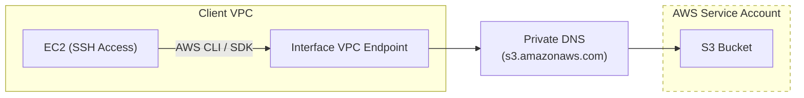

# s3-private-link-demo

> 🚧 **Work in Progress**
>
> This demo is being rebuilt to showcase how to securely access Amazon S3 using AWS PrivateLink (Interface VPC Endpoints).  
> The project currently focuses on Terraform automation and a minimal EC2 test environment.

## Description:
Learn how to establish secure AWS PrivateLink connectivity between two accounts for Amazon S3, keeping traffic within the AWS network (no public internet routing).

## Project Overview:
This project provides a step-by-step guide and AWS CLI-driven workflow to create and configure resources across two AWS accounts for a private S3 access pattern. The goal is to demonstrate how to build and validate a secure, private data path using VPC endpoints.

## Key Features:
- Step-by-step setup with supporting documentation
- AWS CLI commands for provisioning and validation
- Clear separation between Service and Client accounts
- Architecture diagrams to visualize traffic flow
- Security-focused design and best practices

## Why Use This Demo?
- Learn how AWS PrivateLink enables private, cross-account connectivity
- Understand how to access S3 without exposing traffic to the public internet
- Practice account separation and IAM role design
- Build a reusable pattern for secure AWS networking

## Architecture (Draft)

---

This repository is intended as a hands-on reference for building secure, private connectivity patterns in AWS using modern infrastructure practices.
